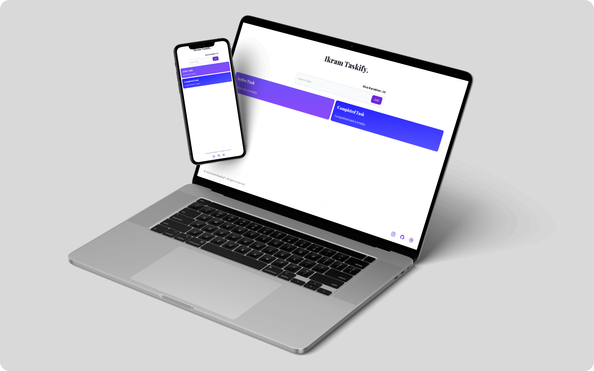

## About Applications

Ikram Tasktify Merupakan Sebuah Aplikasi Task List Berbasis Website Menggunakan ReactJS, TailwindCSS dan React Beautiful DnD.

## Steps to Install and Run Applications on Local Computers

1.  Install [Node.Js](https://nodejs.org/en/download/) and [Git](https://git-scm.com/).
2.  Clone this repository
    `git clone https://github.com/Ikram-Maulana/taskify-app.git`
3.  Open the project folder, then open CMD
4.  To download all the required packages, type the command
    `yarn install`
5.  To run the application in development environment mode type the command
    `yarn start`
6.  To run the application in production environment mode type the command
    `yarn build`

## In-App Features

- [x] Create Task List
- [x] Drag and Drop Task List
- [x] Responsive Design

## Licence

This application is under license [MIT license](https://github.com/Ikram-Maulana/taskify-app/blob/master/LICENSE.md).
